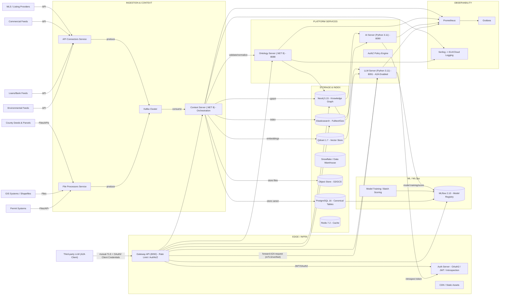

# Binah Ontology Server

> **📚 For detailed technical documentation, see [docs/services/binah-ontology.md](../../docs/services/binah-ontology.md)**

## Features
- Maintain knowledge graph of all construction and real estate entities
- Provide CRUD operations for entities
- Manage relationships between entities (HAS_CONTRACTOR, INVESTS_IN, LOCATED_IN, etc.)
- Execute Cypher queries for complex graph traversals
- Track entity versioning and lineage
- Emit events on graph mutations via Kafka
- Support real-time subscriptions via GraphQL subscriptions

## Old Architecture

